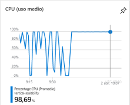
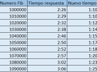
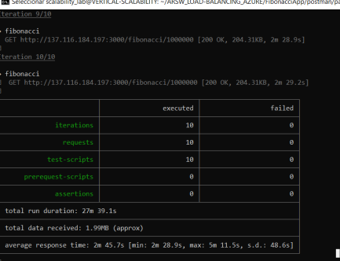
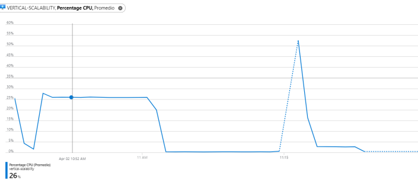
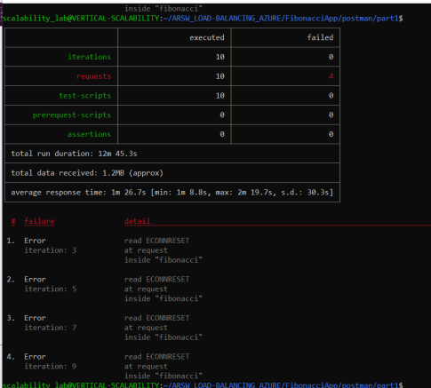
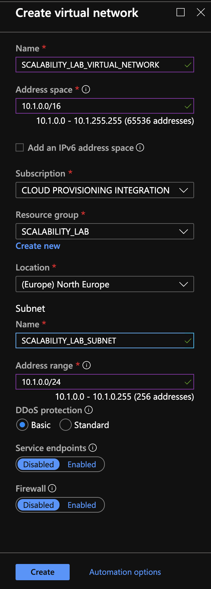
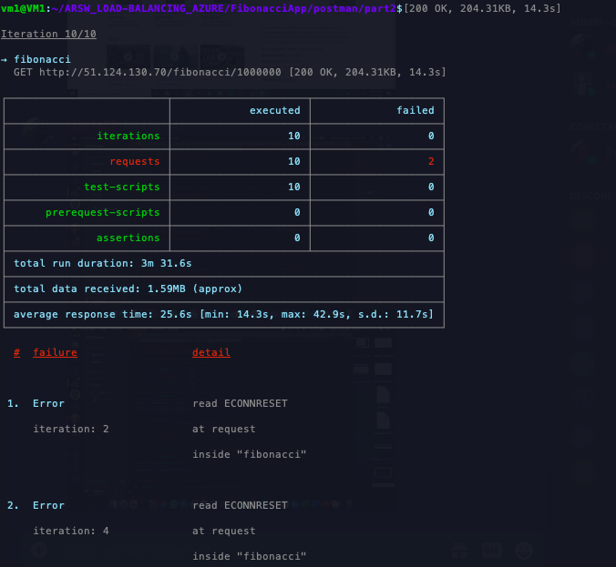
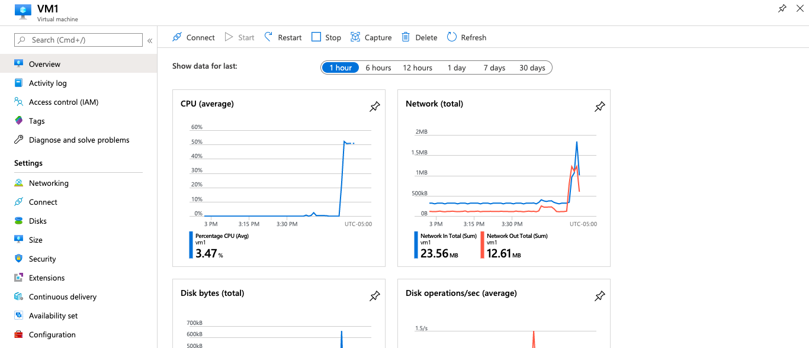
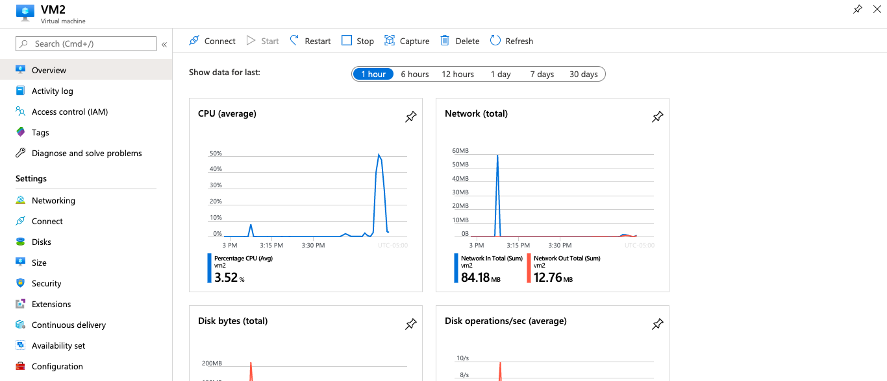
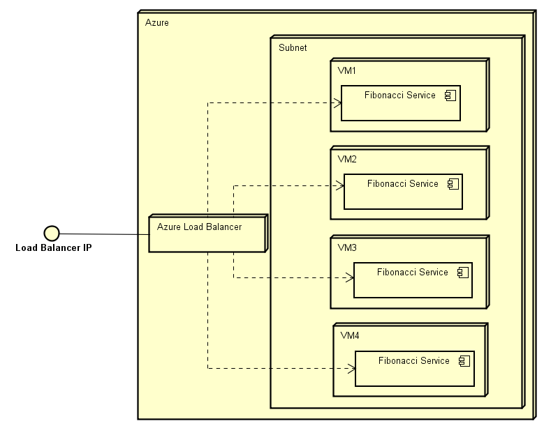

### Escuela Colombiana de Ingeniería
### Arquitecturas de Software - ARSW

## Integrantes
* Carlos Castañeda
* Luis Jaramillo
* Fernando Barrera

## Escalamiento en Azure con Maquinas Virtuales, Sacale Sets y Service Plans

### Dependencias
* Cree una cuenta gratuita dentro de Azure. Para hacerlo puede guiarse de esta [documentación](https://azure.microsoft.com/en-us/free/search/?&ef_id=Cj0KCQiA2ITuBRDkARIsAMK9Q7MuvuTqIfK15LWfaM7bLL_QsBbC5XhJJezUbcfx-qAnfPjH568chTMaAkAsEALw_wcB:G:s&OCID=AID2000068_SEM_alOkB9ZE&MarinID=alOkB9ZE_368060503322_%2Bazure_b_c__79187603991_kwd-23159435208&lnkd=Google_Azure_Brand&dclid=CjgKEAiA2ITuBRDchty8lqPlzS4SJAC3x4k1mAxU7XNhWdOSESfffUnMNjLWcAIuikQnj3C4U8xRG_D_BwE). Al hacerlo usted contará con $200 USD para gastar durante 1 mes.

### Parte 0 - Entendiendo el escenario de calidad

Adjunto a este laboratorio usted podrá encontrar una aplicación totalmente desarrollada que tiene como objetivo calcular el enésimo valor de la secuencia de Fibonnaci.

**Escalabilidad**
Cuando un conjunto de usuarios consulta un enésimo número (superior a 1000000) de la secuencia de Fibonacci de forma concurrente y el sistema se encuentra bajo condiciones normales de operación, todas las peticiones deben ser respondidas y el consumo de CPU del sistema no puede superar el 70%.

### Parte 1 - Escalabilidad vertical

1. Diríjase a el [Portal de Azure](https://portal.azure.com/) y a continuación cree una maquina virtual con las características básicas descritas en la imágen 1 y que corresponden a las siguientes:
    * Resource Group = SCALABILITY_LAB
    * Virtual machine name = VERTICAL-SCALABILITY
    * Image = Ubuntu Server 
    * Size = Standard B1ls
    * Username = scalability_lab
    * SSH publi key = Su llave ssh publica


2. Para conectarse a la VM use el siguiente comando, donde las `x` las debe remplazar por la IP de su propia VM.

    `ssh scalability_lab@xxx.xxx.xxx.xxx`

3. Instale node, para ello siga la sección *Installing Node.js and npm using NVM* que encontrará en este [enlace](https://linuxize.com/post/how-to-install-node-js-on-ubuntu-18.04/).
4. Para instalar la aplicación adjunta al Laboratorio, suba la carpeta `FibonacciApp` a un repositorio al cual tenga acceso y ejecute estos comandos dentro de la VM:

    `git clone <your_repo>`

    `cd <your_repo>/FibonacciApp`

    `npm install`

5. Para ejecutar la aplicación puede usar el comando `npm FibinacciApp.js`, sin embargo una vez pierda la conexión ssh la aplicación dejará de funcionar. Para evitar ese compartamiento usaremos *forever*. Ejecute los siguientes comando dentro de la VM.

    `npm install forever -g`

    `forever start FibinacciApp.js`

6. Antes de verificar si el endpoint funciona, en Azure vaya a la sección de *Networking* y cree una *Inbound port rule* tal como se muestra en la imágen. Para verificar que la aplicación funciona, use un browser y user el endpoint `http://xxx.xxx.xxx.xxx:3000/fibonacci/6`. La respuesta debe ser `The answer is 8`.




7. La función que calcula en enésimo número de la secuencia de Fibonacci está muy mal construido y consume bastante CPU para obtener la respuesta. Usando la consola del Browser documente los tiempos de respuesta para dicho endpoint usando los siguintes valores:
    * 1000000
    * 1010000
    * 1020000
    * 1030000
    * 1040000
    * 1050000
    * 1060000
    * 1070000
    * 1080000
    * 1090000    

8. Dírijase ahora a Azure y verifique el consumo de CPU para la VM. (Los resultados pueden tardar 5 minutos en aparecer).


9. Ahora usaremos Postman para simular una carga concurrente a nuestro sistema. Siga estos pasos.
    * Instale newman con el comando `npm install newman -g`. Para conocer más de Newman consulte el siguiente [enlace](https://learning.getpostman.com/docs/postman/collection-runs/command-line-integration-with-newman/).
    * Diríjase hasta la ruta `FibonacciApp/postman` en una maquina diferente a la VM.
    * Para el archivo `[ARSW_LOAD-BALANCING_AZURE].postman_environment.json` cambie el valor del parámetro `VM1` para que coincida con la IP de su VM.
    * Ejecute el siguiente comando.

    ```
    newman run ARSW_LOAD-BALANCING_AZURE.postman_collection.json -e [ARSW_LOAD-BALANCING_AZURE].postman_environment.json -n 10 &
    newman run ARSW_LOAD-BALANCING_AZURE.postman_collection.json -e [ARSW_LOAD-BALANCING_AZURE].postman_environment.json -n 10
    ```

10. La cantidad de CPU consumida es bastante grande y un conjunto considerable de peticiones concurrentes pueden hacer fallar nuestro servicio. Para solucionarlo usaremos una estrategia de Escalamiento Vertical. En Azure diríjase a la sección *size* y a continuación seleccione el tamaño `B2ms`.


11. Una vez el cambio se vea reflejado, repita el paso 7, 8 y 9.
12. Evalue el escenario de calidad asociado al requerimiento no funcional de escalabilidad y concluya si usando este modelo de escalabilidad logramos cumplirlo.
13. Vuelva a dejar la VM en el tamaño inicial para evitar cobros adicionales.

**Preguntas**

1. ¿Cuántos y cuáles recursos crea Azure junto con la VM?

   * Grupo de recursos
   * Opciones de disponibilidad 
   * Discos
   * red virtual
   * IP publica 
   * Network interface

2. ¿Brevemente describa para qué sirve cada recurso?

   * Grupo de recursos: Sirver para contener todos los recursos que comparten los mismos permisos y directivas.
   * Opciones de disponibilidad: Sirve para administrar la disponibilidad de las aplicaciones.
   * Discos: Almacenaminento de la maquina virtual de Azure.
   * Red virtual: Permite que muchos tipos de recursos de Azure, como las Máquinas Virtuales Azure (VM), se comuniquen de forma segura entre sí,con el Internet y con redes locales on-premise.
   * IP publica: Se usa esta direccion IP para comunicar la maquina virtual desde fuera de la red virtual.
   * Network interface: Una interfaz de red permite que una máquina virtual Azure se comunique con el Internet y con recursos  locales.
   
3. ¿Al cerrar la conexión ssh con la VM, por qué se cae la aplicación que ejecutamos con el comando `npm FibonacciApp.js`? ¿Por qué debemos crear un *Inbound port rule* antes de acceder al servicio?

   * Al ejecutar el comando npm FibonacciApp.js este correra la aplicación, pero cada vez que se cierre la conexión perderemos el proceso corriendo por lo cual es necesario la implmentación de forever nuevamente, ya que este comando nos permite correr el servicio apenas la maquna este prendida.
   * El *Inbound port rule* sirve para que la maquina virtual que estamos creando se pueda acceder por un puerto determiando, para este caso abrimos la aplicacion con el puerto 3000.

4. Adjunte tabla de tiempos e interprete por qué la función tarda tando tiempo.



   * La función es iterativa, pero no mantiene en memoria los resultados previos, por lo que, al ejecutar Fibonacci de un número anteriormente calculado, la función vuelve a realizar todo el algoritmo para obtener la respuesta. Incrementando los tiempos de ejecución y consumo de CPU.
      
5. Adjunte imágen del consumo de CPU de la VM e interprete por qué la función consume esa cantidad de CPU.


   * Fibonacci es un algoritmo que consume mucho procesador al momento de calcular numeros grnades, al implementar la función sin ningún tipo memorización o cache y sobre un procesador de bajas especificaciones, el consumo de este se vuelve evidente, como se muestra en la imagen anterior.

6. Adjunte la imagen del resumen de la ejecución de Postman. Interprete:
   
    
    
    * Tiempos de ejecución de cada petición. 
    * Si hubo fallos documentelos y explique.

      * Tubo un total de 4 fallos, esto se daba escencialmente porque la maquina virtual estaba ocupada cuando se le realizaba la peticion, ya que estaba procesando todavia otra de las petciiones anteriores.    
    
7. ¿Cuál es la diferencia entre los tamaños `B2ms` y `B1ls` (no solo busque especificaciones de infraestructura)?

    * La maquina que contabamos al principo tenia unos recursos limitados y solo contaba con 1 cpu y 0.75 gb RAM, en cambio cuando cambiamos de tamaño por un  A6 contamos con una memoria RAM de 4gb, por lo que puede tiene una mejor disponibilidad con respecto a las peticiones que se realicen.

8. ¿Aumentar el tamaño de la VM es una buena solución en este escenario?, ¿Qué pasa con la FibonacciApp cuando cambiamos el tamaño de la VM?

   * Para este escenario puede ser una buena solución si se desea aumentar la cantidad de peticiones que se pueden realizar concurrentemente al servidor, sin embargo, si se desea aumentar el tiempo de respuesta, se debe buscar una mejor manera de implementar la aplicación FibonacciApp.js.

9. ¿Qué pasa con la infraestructura cuando cambia el tamaño de la VM? ¿Qué efectos negativos implica?
 
   * Cuando se cambia el tamaño de la VM esta debe de reiniciarse, lo cual conlleva que la aplicación se detenga y su disponibilidad disminuya. Cuando se inicia la VM se debe volver a iniciar el servicio FibonacciApp.

10. ¿Hubo mejora en el consumo de CPU o en los tiempos de respuesta? Si/No ¿Por qué?
   
   * Si mejoraron, ya que disminuyo el tiempo de respuesta casi un minuto por cada instancia, y esto debido a que cambiamos el tamaño de la maquina por una de 4gb.

11. Aumente la cantidad de ejecuciones paralelas del comando de postman a `4`. ¿El comportamiento del sistema es porcentualmente mejor?





   * Se evidencio una mejora en el procesamiento ya que hace mejor uso de la cpu y esto se vio reflejado en los tiempo de respuesta de las peticiones  paralelas y en la grafica del uso de la cpu


### Parte 2 - Escalabilidad horizontal

#### Crear el Balanceador de Carga

Antes de continuar puede eliminar el grupo de recursos anterior para evitar gastos adicionales y realizar la actividad en un grupo de recursos totalmente limpio.

1. El Balanceador de Carga es un recurso fundamental para habilitar la escalabilidad horizontal de nuestro sistema, por eso en este paso cree un balanceador de carga dentro de Azure tal cual como se muestra en la imágen adjunta.


2. A continuación cree un *Backend Pool*, guiese con la siguiente imágen.


3. A continuación cree un *Health Probe*, guiese con la siguiente imágen.


4. A continuación cree un *Load Balancing Rule*, guiese con la siguiente imágen.


5. Cree una *Virtual Network* dentro del grupo de recursos, guiese con la siguiente imágen.



#### Crear las maquinas virtuales (Nodos)

Ahora vamos a crear 3 VMs (VM1, VM2 y VM3) con direcciones IP públicas standar en 3 diferentes zonas de disponibilidad. Después las agregaremos al balanceador de carga.

1. En la configuración básica de la VM guíese por la siguiente imágen. Es importante que se fije en la "Avaiability Zone", donde la VM1 será 1, la VM2 será 2 y la VM3 será 3.


2. En la configuración de networking, verifique que se ha seleccionado la *Virtual Network*  y la *Subnet* creadas anteriormente. Adicionalmente asigne una IP pública y no olvide habilitar la redundancia de zona.


3. Para el Network Security Group seleccione "avanzado" y realice la siguiente configuración. No olvide crear un *Inbound Rule*, en el cual habilite el tráfico por el puerto 3000. Cuando cree la VM2 y la VM3, no necesita volver a crear el *Network Security Group*, sino que puede seleccionar el anteriormente creado.


4. Ahora asignaremos esta VM a nuestro balanceador de carga, para ello siga la configuración de la siguiente imágen.


5. Finalmente debemos instalar la aplicación de Fibonacci en la VM. para ello puede ejecutar el conjunto de los siguientes comandos, cambiando el nombre de la VM por el correcto

```
git clone https://github.com/daprieto1/ARSW_LOAD-BALANCING_AZURE.git

curl -o- https://raw.githubusercontent.com/creationix/nvm/v0.34.0/install.sh | bash
source /home/vm1/.bashrc
nvm install node

cd ARSW_LOAD-BALANCING_AZURE/FibonacciApp
npm install

npm install forever -g
forever start FibonacciApp.js
```

Realice este proceso para las 3 VMs, por ahora lo haremos a mano una por una, sin embargo es importante que usted sepa que existen herramientas para aumatizar este proceso, entre ellas encontramos Azure Resource Manager, OsDisk Images, Terraform con Vagrant y Paker, Puppet, Ansible entre otras.

#### Probar el resultado final de nuestra infraestructura

1. Porsupuesto el endpoint de acceso a nuestro sistema será la IP pública del balanceador de carga, primero verifiquemos que los servicios básicos están funcionando, consuma los siguientes recursos:

```
http://52.155.223.248/
http://52.155.223.248/fibonacci/1
```

2. Realice las pruebas de carga con `newman` que se realizaron en la parte 1 y haga un informe comparativo donde contraste: tiempos de respuesta, cantidad de peticiones respondidas con éxito, costos de las 2 infraestrucruras, es decir, la que desarrollamos con balanceo de carga horizontal y la que se hizo con una maquina virtual escalada.

3. Agregue una 4 maquina virtual y realice las pruebas de newman, pero esta vez no lance 2 peticiones en paralelo, sino que incrementelo a 4. Haga un informe donde presente el comportamiento de la CPU de las 4 VM y explique porque la tasa de éxito de las peticiones aumento con este estilo de escalabilidad.

```
newman run ARSW_LOAD-BALANCING_AZURE.postman_collection.json -e [ARSW_LOAD-BALANCING_AZURE].postman_environment.json -n 10 &
newman run ARSW_LOAD-BALANCING_AZURE.postman_collection.json -e [ARSW_LOAD-BALANCING_AZURE].postman_environment.json -n 10 &
newman run ARSW_LOAD-BALANCING_AZURE.postman_collection.json -e [ARSW_LOAD-BALANCING_AZURE].postman_environment.json -n 10 &
newman run ARSW_LOAD-BALANCING_AZURE.postman_collection.json -e [ARSW_LOAD-BALANCING_AZURE].postman_environment.json -n 10
```

**Preguntas**

* ¿Cuáles son los tipos de balanceadores de carga en Azure y en qué se diferencian?, ¿Qué es SKU, qué tipos hay y en qué se diferencian?, ¿Por qué el balanceador de carga necesita una IP pública?

   - Existen dos tipos de balanceadores, el publico "Public Load Balance" y el interno "Internal Load Balancer", "Public Load Balancer" asigna la dirección IP pública y el puerto del tráfico entrante a la dirección IP privada, el "Internal Load Balancer" dirige el tráfico sólo a los recursos que están contenidos en la red virtual.
   - Un SKU (Stock Keeping Unit) hace referencia a una unidad la cual es dferente por cada uno de los servicios de Azure y puede ser comparada con otro producto. Los grupos de SKU se diferencian en "precio" y "rendimiento o desempeño"
   - Un balanceador de carga necesita una IP, esta debe ser pública, ya que actúa como el único punto con el que los clientes interactúan con la aplicación, es el encargado de distribuir el tráfico entre varios nodos disponibles.

* ¿Cuál es el propósito del *Backend Pool*?

   * Un grupo de backend en Front Door se refiere al conjunto de backends que reciben tráfico similar para su aplicación. Es una agrupación lógica de instancias de aplicaciones en todo el mundo que reciben el mismo tráfico y responden con el comportamiento esperado.

* ¿Cuál es el propósito del *Health Probe*?
   * Las peticiones de sonde HTTP/HTTPS a cada backend configurado, son enviadas con el propósito de determinar proximidad y salud de los backends para equilibrar las cargas de las solicitudes de los usuarios.

* ¿Cuál es el propósito de la *Load Balancing Rule*? ¿Qué tipos de sesión persistente existen, por qué esto es importante y cómo puede afectar la escalabilidad del sistema?

   * Load Balancing Rule sirve para distribuir el tráfico que llega al front hacia los backend pools.
   Azure maneja 3 tipos de sesión de persistencia:
   - None: Especifica que las solicitudes sucesivas del mismo cliente pueden ser manejadas por cualquier máquina virtual.
   - Client IP: Las peticiones sucesivas de la misma dirección IP del cliente serán gestionadas por la misma máquina virtual.
   - Client IP and Protocol: Las solicitudes sucesivas de la misma combinación de dirección IP de cliente y protocolo serán tratadas por la misma máquina virtual.

* ¿Qué es una *Virtual Network*? ¿Qué es una *Subnet*? ¿Para qué sirven los *address space* y *address range*?

   * Una red virtual permite que muchos tipos de recursos de Azure, como las máquinas virtuales de Azure (VM), se comuniquen de manera segura entre sí, Internet y redes locales. VNet es similar a una red tradicional que operaría en su propio centro de datos, pero trae consigo beneficios adicionales de la infraestructura de Azure, como escala, disponibilidad y aislamiento.
   
   * Las subredes le permiten segmentar la red virtual en una o más subredes y asignar una parte del espacio de direcciones de la red virtual a cada subred. Luego puede implementar recursos de Azure en una subred específica. Al igual que en una red tradicional, las subredes le permiten segmentar el espacio de direcciones de su red virtual en segmentos que son apropiados para la red interna de la organización. Esto también mejora la eficiencia de asignación de direcciones. Puede proteger los recursos dentro de las subredes utilizando Grupos de seguridad de red.
   
   * Un address space especifica un espacio de direcciones IP privado personalizado utilizando direcciones públicas y privadas. Azure asigna a los recursos en una red virtual una dirección IP privada desde el espacio de direcciones que se asigne. Un address range es el rango de direcciones IP que se define a partir del address space.

* ¿Qué son las *Availability Zone* y por qué seleccionamos 3 diferentes zonas?. ¿Qué significa que una IP sea *zone-redundant*?

   * Availability Zones es una oferta de alta disponibilidad que protege sus aplicaciones y datos de fallas en el centro de datos. Las zonas de disponibilidad son ubicaciones físicas únicas dentro de una región de Azure. 


   * Una IP zone-redundant sirve para beneficiarse de las resistencia de zona para acceder a sus servicios escalables y de misión crítica de Azure.


* ¿Cuál es el propósito del *Network Security Group*?

   * Puede filtrar el tráfico de red hacia y desde los recursos de Azure en una red virtual de Azure con un grupo de seguridad de red. Un grupo de seguridad de red contiene reglas de seguridad que permiten o niegan el tráfico de red entrante a, o el tráfico de red saliente, de varios tipos de recursos de Azure.  

* Informe de newman 1 (Punto 2)

   * 3 VM con 4 peticiones en paralelo.
   
   

   * 4 VM con 4 peticiones en paralelo.
   
   

   * Al ejecutar kas 4 maquinas, el tiempo de ejecucion se reduce notablemente, ya que tienen un nodo mas. 
   * Rendimiento VM1.
   
   

   * Rendimiento VM2.
   
   

   * Como notamos, las maquinas tienen un rendimiento similar. 

* Presente el Diagrama de Despliegue de la solución.




